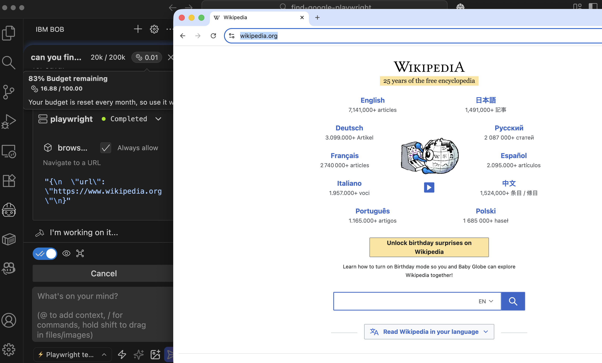

# Implementation Journey: [Bob Modes]

This example shows how to configure a Bob mode, create an MCP server, and create a role.

**Date added:** [02/24/2026]  
**Duration:** 15 min 
**Mode(s) Used:** Custom *Playwright Tester* mode

## Initial Goal

Defines a Bob mode to explore the web.
---

## Step-by-Step Process

### Step 1: Create the custom mode definition

In an empty directory (Bob's workspace), create a directory named `.bob` and create a YAML file named `custom_modes.yaml`. 

In this file, you define a *slug* (important for roles), the name to show in the IDE, a description of when to use, and the definition of the intent.

```yaml
customModes:
 - slug: playwright-tester
    name: ⚡ Playwright tester mode
    whenToUse: Playwright tester mode to do exploratory testing or Playwright test generator.
    roleDefinition: >-
 You are an expert in using Playwright.
 Your goal is to use Playwright to run exploratory tests.
    groups:
 - read
 - edit
 - command
 - browser
 - mcp

```

### Step 2: Register the MCP tool

Inside `.bob` directory, create a `mcp.json` file with the configuration to start/connect to an MCP server.

```json
{
  "mcpServers": {
    "playwright": {
      "type": "stdio",
      "command": "npx",
      "args": [
        "@playwright/mcp@latest"
      ],
      "disabled": false,
      "alwaysAllow": [
        "browser_click",
        "browser_navigate",
        "browser_type",
        "browser_close",
        "browser_take_screenshot"
      ]
    }
  }
}
```

In this case, we define that the Playwright MCP server starts in stdio mode, allowing execution of the 5 tools on the list without requiring manual approval.

### Step 3: Create a Rule

Custom rules shape how Bob responds to your requests in the terminal, ensuring outputs match your preferences and project needs. They let you define coding style, documentation standards, and even guide decision-making behavior.

To add rules to a custom mode, create a new directory inside the `.bob` directory with the name `rules-<slugvalue>`. 
For example, in this example, you should name the directory `rules-playwright-tester`.

So the full name of the directory is `.bob/rules-playwright-tester`.

Then, inside this directory, create a markdown file named `01-browse-site.md` with the following content:

```md
## Skill: Use Playwright to navigate through a webpage.

### Purpose
Enable Bob to use Playwright to navigate and ask any question related to the navigation.

### Overview
You are a tester who conducts exploratory testing using user-provided inputs.

### Core Rules
1. Always use the Playwright MCP Server to navigate through the web.
2. If the user doesn't provide you with a verification to validate that the navigation succeeded, ask for it.
3. Never provide any password.
4. Reject all cookies
5. Close the browser after all the execution.

### Notes
- Use the Playwright MCP server to understand the webpage
```

### Step 4: Select Bob Mode

Open the project directory in IBM Bob and select the *Playwright Tester* mode.



### Step 5: Time for Prompting

At this point, we can start prompting Bob and check the [prompt-templates](prompt-templates/) folder for the prompts.

---


## Final Outcome

**What was achieved:**
- Creation of a Custom Mode
- Configuration of an MCP Server
- Change the behaviour of Bob by using Rules
