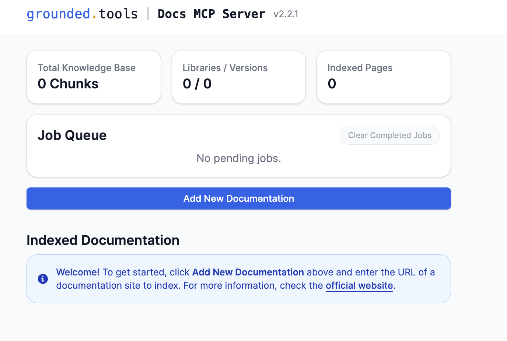
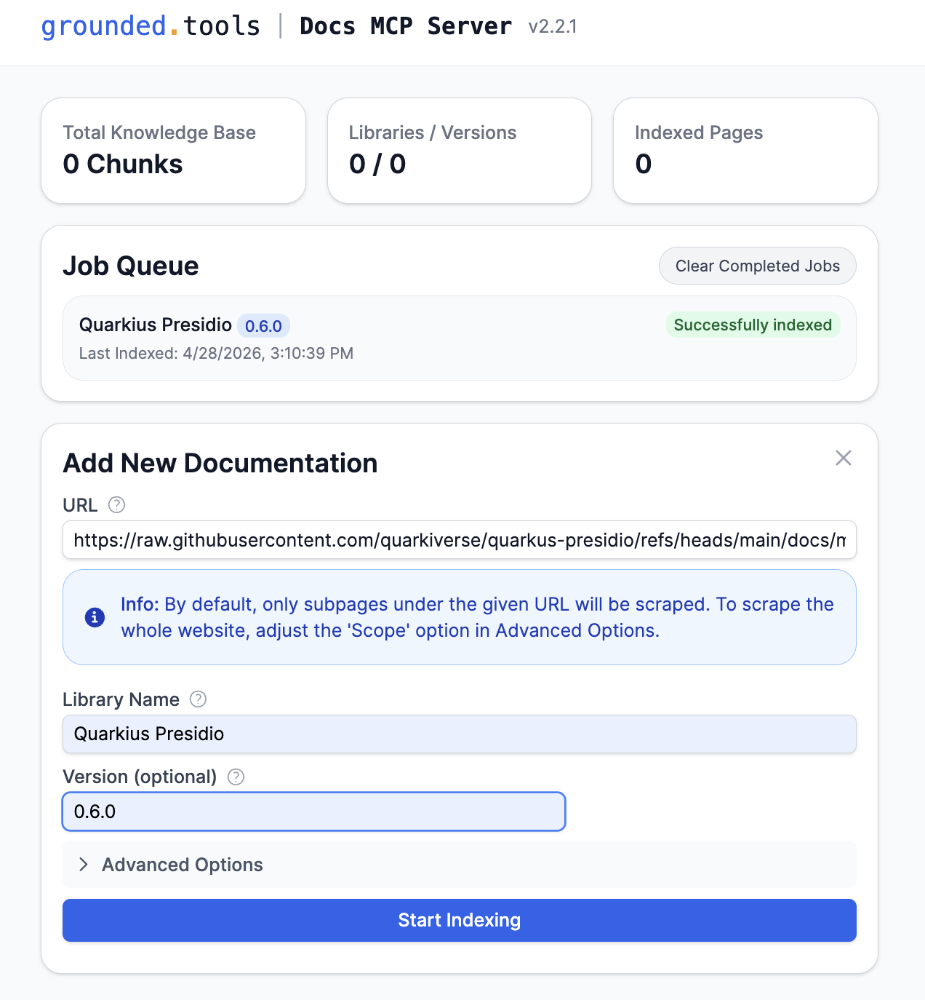

# Implementation Journey: [Internal Docs]

This section introduces you to how to turn new releases of frameworks, company frameworks, service templates, and best practices into useful context for agent-assisted development.

**Date added:** [04/29/2026]  
**Duration:** 10 min 
**Mode(s) Used:** *Advanced* mode

## Initial Goal

Use Grounded Docs (https://github.com/arabold/docs-mcp-server) to index the documentation of a framework, and have Bob use it to generate the correct code.

---

## Basic Example. Step-by-Step Process

### Step 1: Install Grounded Docs

Grounded Docs (https://github.com/arabold/docs-mcp-server) is available as an executable and a container. 
To simplify the deployment and execution, we'll use the container approach.
In a terminal, run the following command:

```bash
podman run --rm \
 -v docs-mcp-data:/data \
            -v docs-mcp-config:/config \
 -p 6280:6280 \
            ghcr.io/arabold/docs-mcp-server:latest \
 --protocol http --host 0.0.0.0 --port 6280
```

Notice that we are providing volumes as well; this is useful for keeping processed data after a restart.
For a quick demo, this isn't necessary. If you plan to use it extensively, please add the Volumes part.

**Outcome:**

Grounded Docs (with MCP support) is running on your computer.

### Step 2: Index documentation

Open the Grounded Docs UI in a browser by navigating to: http://localhost:6280/

Then click on the _Add New Documentation_ button:



Then fill the form with the following parameters:

URL: https://raw.githubusercontent.com/quarkiverse/quarkus-presidio/refs/heads/main/docs/modules/ROOT/pages/index.adoc
Library Name: Quarkus Presidio
Version 0.6.0



Then click _Start Indexing_, and after a few seconds, Grounded Docs indexes the documentation and makes it available.

**Outcome:** 

Bob can query Grounded Docs to find information/best practices, and how-to code using the Quarkus Presidio extension.


### Step 3: Open Project In Bob

Open IBM Bob and open the `input-documents/pii-presidio` project.

**Outcome:** 

Quakrus project mounted in IBM Bob.

### Step 4: Register Grounded Docs MCP Server

Now, configure IBM Bob to connect to the Grounded Doc MCP Server. Create the `.bob` directory and create the `mcp.json` file with the following content:

```json
{
    "mcpServers": {
        "docs-mcp-server": {
            "type": "sse",
            "url": "http://localhost:6280/sse",
            "disabled": false,
            "alwaysAllow": []
 }
 }
}
```

Save the file and restart IBM Bob to ensure the changes take effect.

### Step 5: Prompt Bob

Now, we can prompt Bob to use Quarkus Presidio in the project, using the knowledge provided by Grounded Docs, rather than the content LLM has in its knowledge.

Run the following prompt: `Show me how to use Quarkus Presidio 0.6.0 to anonymize data`.

**Bob Response:**

Bob will ask for permission to access the MCP Server to get information about Quarkus Presidio, then, with all the context, it will start generating some Java code using Presidio.

## Key Decisions

### Decision 1: Use Grounded Docs instead of Skills

**Context:**

Bob needs to know how to use the latest library knowledge.

**Options Considered:** 

Using Skills by adding all the important parts of the documentation there.

**Choice Made:**

Use the Grounded Docs tool.

**Rationale:** 

Skills work well for specifying execution flow or specific tasks, but when you want to provide context for a full project, where multiple versions can exist.
Also, the documentation might be extensive, so it's better to manage it correctly in chunks. 

Moreover, Skills are local files that might differ from computer to computer, be outdated, ... but Grounded Docs acts as a hub for documentation for all members of the organization.


## Final Outcome

**What was achieved:**
- Grounded Docs running 
- Provide context to Bob using custom documentation
