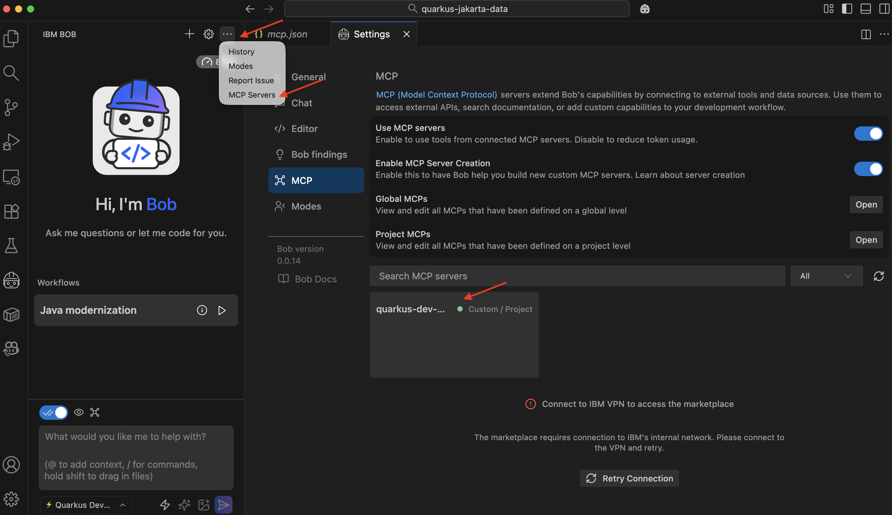
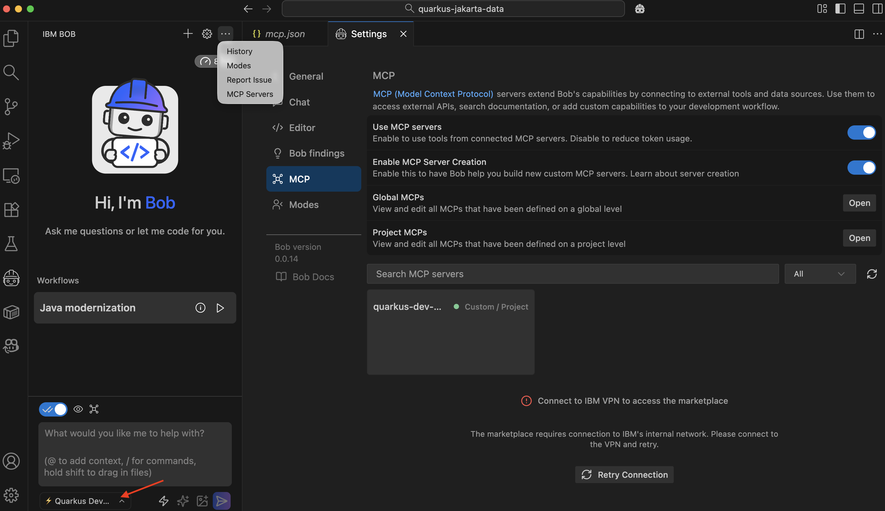

# Implementation Journey: [Exposing MCP from Legacy Java]

This demo shows how to expose a legacy application as an MCP Server without modifying its code.

If you want to learn more about the process followed in the demo, you can read the post: https://www.the-main-thread.com/p/exposing-mcp-legacy-java-jakarta-ee-architecture, which explains different approaches to achieve this goal.

**Date added:** [03/9/2026]  
**Duration:** 20 min 
**Mode(s) Used:** Custom *Quarkus Developer* mode

## Initial Goal

Expose a legacy Kubernetes application as an MCP Server without modifying the original codebase.

---

## Step-by-Step Process

### Step 1: Start Quarkus MCP Server

Go to a terminal window, and inside [input-documents/petclinic-mcp-bob](input-documents/petclinic-mcp-bob) run the following command: `./mvnw quarkus:dev`

This command will start the Quarkus application in dev mode with the MCP Server enabled.
Then open IBM Bob IDE and open the `input-documents/petclinic-mcp-bob` project.

**Bob's response:**

Verify that Bob is connected to the Quarkus MCP Server by inspecting the MCP tab:

**Outcome:**

IBM Bob is now connected to the Quarkus MCP Server.

### Step 2: Select Quarkus Developer

To use the Quarkus Developer mode to migrate projects to AI, we created a custom Bob mode with rules to guide integration with AI.

**Bob's response:** 

Go to the bottom-left dropdown menu and select _Quarkus Developer_ mode.

**Outcome:**

> [!NOTE]
> Take a look at the folder [input-documents/petclinic-mcp-bob/.bob](input-documents/petclinic-mcp-bob/.bob) to see the details of the custom mode and the mcp configuration.

### Step 3: Time for Prompting

At this point, we can start prompting Bob and check the [prompt-templates](prompt-templates/) folder for the prompts.

---

## Key Decisions

### Decision 1: Create a Custom Mode with MCP

**Context:**

Bob needs to add the correct dependencies/extensions in the Quarkus project to use Quarkus MCP Server.

**Options Considered:** 

Bob could modify the `pom.xml` file directly, adding the dependencies.

**Choice Made:**

Implement a custom mode connecting to the Quarkus MCP Server.

**Rationale:** 

Quarkus provides an [MCP Server](https://quarkus.io/guides/dev-mcp) to find the currently installed extensions, list all available extensions, and set the extension to the correct versions.
In this way, we make Quarkus decide which version to use in each case.

### Decision 2: Create Rules for the integration

**Context:** 

Bob has the knowledge to code in Quarkus and to provide LangChain4j integration, but in most cases, you want Bob to produce code that follows defined patterns.

**Options Considered:** 

Let Bob produce the code without any guidelines.

**Choice Made:** 

Create specific rules for the mode.

**Rationale:**

Even though Bob could generate code by its own, we decided to provide some guidelines, as this is more of a realistic scenario.

---

### Challenge 1: Hallucinations with wide context

**Issue:** 

If the prompt was too generic, like: _Transform this application into an MCP application_, the solution produced by Bob could be far from perfect, hallucinating or guessing too much.  

**Solution:** 

Implement all integrations with multiple prompts, executing each in turn.

**Learning:**

Always better to have multiple prompts rather than one containing all the information.

---

## Final Outcome

**What was achieved:**
- Quarkus application integrated with LangChain4j
- Quarkus MCP Server
- Kubernetes deployment file with a sidecar container
